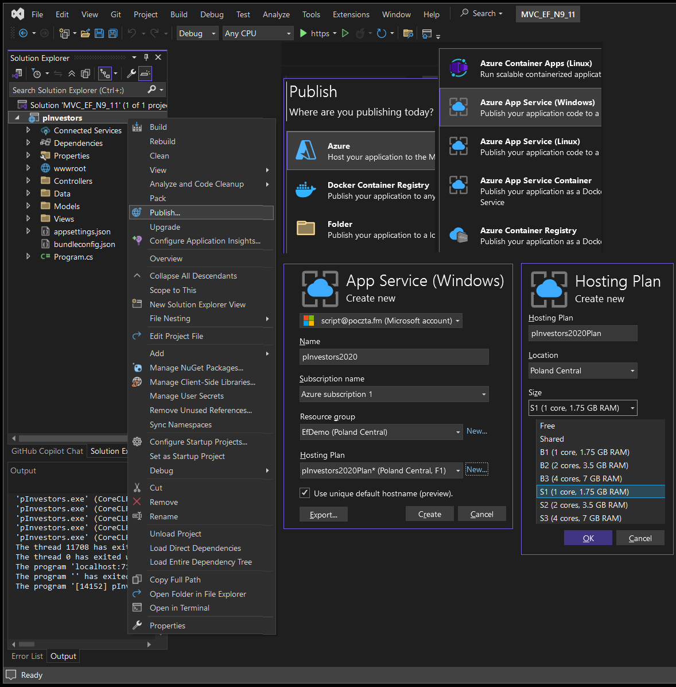

# ☁ Hosting applications on Azure

##Azure App Service – Key Options for ASP.NET Apps

Azure App Service is a fully managed platform for hosting web apps, REST APIs, and mobile backends. It supports multiple languages and frameworks, and offers built-in scaling, security, and integration features.

## 🔹 App Service Plan
Defines pricing tier and available resources (CPU, memory, scaling).

### 📌 Choose a Tier:
- **Free / Shared** – For development and testing only
- **Basic / Standard / Premium** – More power, custom domains, staging slots
- **Isolated** – Runs in private VNET; higher security and performance

## 🔹 Runtime Stack / Framework
Choose the framework your app runs on:
- ASP.NET (.NET Core or .NET Framework)
- Java, Node.js, Python, PHP, Ruby

### 📌 For ASP.NET apps:
- Select the correct version (e.g., .NET 6, .NET 8)

## 🔹 Region
Select an Azure datacenter location for hosting.

### 📌 Best Practice:
- Choose a region close to your users for lower latency

## 🔹 Deployment Method
Ways to publish your app to Azure:

- ✅ Visual Studio Publish
- ✅ GitHub Actions / Azure DevOps CI/CD
- ✅ FTP or ZIP deploy
- ✅ Azure CLI / PowerShell

## 🔹 Scaling (via App Service Plan)

### 📌 Manual Scaling:
- Set a fixed number of instances

### 📌 Auto-Scaling:
- Scale based on rules (CPU, memory usage)

## 🔹 Custom Domain & SSL

### 📌 Custom Domain:
- Map your own domain (e.g., `myapp.com`)

### 📌 SSL Certificates:
- Free or bring-your-own

## 🔹 App Settings & Configuration

- Store environment variables and connection strings
- Secure sensitive data using **Azure Key Vault**

## 🔹 Monitoring & Logs

- Enable **Application Insights** for performance and error tracking
- View logs, metrics, and diagnostics in the Azure Portal

## 🔷 Publishing your app to Azure.
You can publish your app to Azure from VS2022 as shown below:

